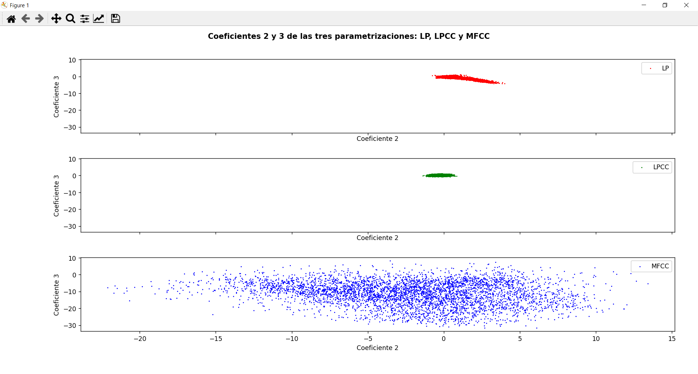

PAV - P4: reconocimiento y verificación del locutor
===================================================

Obtenga su copia del repositorio de la práctica accediendo a [Práctica 4](https://github.com/albino-pav/P4)
y pulsando sobre el botón `Fork` situado en la esquina superior derecha. A continuación, siga las
instrucciones de la [Práctica 2](https://github.com/albino-pav/P2) para crear una rama con el apellido de
los integrantes del grupo de prácticas, dar de alta al resto de integrantes como colaboradores del proyecto
y crear la copias locales del repositorio.

También debe descomprimir, en el directorio `PAV/P4`, el fichero [db_8mu.tgz](https://atenea.upc.edu/pluginfile.php/3145524/mod_assign/introattachment/0/spk_8mu.tgz?forcedownload=1)
con la base de datos oral que se utilizará en la parte experimental de la práctica.

Como entrega deberá realizar un *pull request* con el contenido de su copia del repositorio. Recuerde
que los ficheros entregados deberán estar en condiciones de ser ejecutados con sólo ejecutar:

~~~~~~~~~~~~~~~~~~~~~~~~~~~~~~~~~~~~~~~~~~~~~~~~~~~~~.sh
  make release
  run_spkid mfcc train test classerr verify verifyerr
~~~~~~~~~~~~~~~~~~~~~~~~~~~~~~~~~~~~~~~~~~~~~~~~~~~~~

Recuerde que, además de los trabajos indicados en esta parte básica, también deberá realizar un proyecto
de ampliación, del cual deberá subir una memoria explicativa a Atenea y los ficheros correspondientes al
repositorio de la práctica.

A modo de memoria de la parte básica, complete, en este mismo documento y usando el formato *markdown*, los
ejercicios indicados.

## Ejercicios.

### SPTK, Sox y los scripts de extracción de características.

- Analice el script `wav2lp.sh` y explique la misión de los distintos comandos involucrados en el *pipeline*
  principal (`sox`, `$X2X`, `$FRAME`, `$WINDOW` y `$LPC`). Explique el significado de cada una de las 
  opciones empleadas y de sus valores.
  >
  > En el script `wav2lp.sh` encontramos el siguiente *pipeline* principal:
  >
~~~~~~~~~~~~~~~~~~~~~~~~~~~~~~~~~~~~~~~~~~~~~~~~~~~~~~~~~~~~~~~~~~~~~~~~~~~~~~~~~~~~~~~~~~~~~~~~~~.sh
# Main command for feature extraction
sox $inputfile -t raw -e signed -b 16 - | $X2X +sf | $FRAME -l 240 -p 80 | $WINDOW -l 240 -L 240 |
   $LPC -l 240 -m $lpc_order > $base.lp
~~~~~~~~~~~~~~~~~~~~~~~~~~~~~~~~~~~~~~~~~~~~~~~~~~~~~~~~~~~~~~~~~~~~~~~~~~~~~~~~~~~~~~~~~~~~~~~~~~
  >
  > Los distintos comandos involucrados son:
  >
  > * `sox`: es una utilidad de línea de comandos multiplataforma (Windows, Linux, MacOS X, etc.) que puede 
  > convertir varios formatos de archivos de audio a otros formatos. También puede aplicar varios efectos a 
  > estos archivos de sonido y, además, SoX puede reproducir y grabar archivos de audio en la mayoría de las 
  > plataformas. En nuestro caso, el fichero de entrada en formato raw se ha convertido a un formato de enteros
  > con signo (signed-integer) de 16 bits por muestra mediante el uso de las opciones `-t`, `-e` y `-b`.
  >
  >   * `-t`: indica el formato del fichero de audio de entrada. En nuestro caso, raw.
  >   * `-e`: indica el tipo de codificación que se aplica al fichero de entrada. En nuestro caso, signed-integer.
  >   * `-b`: indica el número de bits por muestra (sample size) empleado en la codificación. En nuestro caso, 16 bits.
  >
  > * `$X2X`: convierte un tipo de datos a otro. En nuestro caso, se emplea una conversión de 2 Bytes a 4 Bytes.
  >           Esto se observa en el comando *+sf*, donde la opción *+s* indica *short* y *+f* indica *float*.
  >
  > * `$FRAME`: divide la secuencia de datos de un archivo en diferentes tramas. En nuestro caso, divide las muestras
  >             en segmentos de 240 muestras (indicado por la opción *-l*) con un desplazamiento entre tramas de 80 
  >             muestras (indicado por la opción *-p*).
  >
  > * `$WINDOW`: enventana una trama de datos mediante la multiplicación de los elementos del señal de entrada de 
  >              duración *l* por los elementos de una ventana determinada *w*, obteniendo como resultado una trama 
  >              enventanada de duración *L*. En nuestro caso, se ha empleado una longitud de ventana igual a la de 
  >              la trama (*l*=*L*=240 muestras) y se ha dejado el valor de la ventana por defecto (*w*=0), que se 
  >              trata de una ventana **Blackman**. 
  >
  > * `$LPC`: calcula los coeficientes de predicción lineal (LPC) de orden *m* de las *l* muestras del señal de entrada.
  >           En nuestro caso, *l*=240 (como hemos visto antes) y, con la opción *-m*, el usuario introduce el número
  >           desado de coeficientes.

- Explique el procedimiento seguido para obtener un fichero de formato *fmatrix* a partir de los ficheros de
  salida de SPTK (líneas 45 a 47 del script `wav2lp.sh`).
  >
  > En las líneas 45 a 47 encontramos los siguientes comandos:
  >
~~~~~~~~~~~~~~~~~~~~~~~~~~~~~~~~~~~~~~~~~~~~~~~~~~~~~~~~~~~~~~~~~~~~~~~.sh
# Our array files need a header with the number of cols and rows:
ncol=$((lpc_order+1)) # lpc p =>  (gain a1 a2 ... ap) 
nrow=`$X2X +fa < $base.lp | wc -l | perl -ne 'print $_/'$ncol', "\n";'`
~~~~~~~~~~~~~~~~~~~~~~~~~~~~~~~~~~~~~~~~~~~~~~~~~~~~~~~~~~~~~~~~~~~~~~~
  >
  > En *ncol* se especifica el número de columnas de la matriz. En este caso, el número de columnas debe ser 
  > igual al orden del LPC más uno, ya que el primer elemento de la matriz (primera columna) indica la ganancia
  > del sistema.
  >
  > En *nrow* se convierte el contenido del fichero temporal `$base.lp` de *float* (indicado por *+f*) a *ASCII* 
  > (indicado por *+a*). La opción *wc -l* cuenta el número de líneas del fichero ASCII para obtener el número de 
  > filas de la matriz del fichero resultante *fmatrix*. Finalmente, el comando *perl -ne* imprime la matriz 
  > resultante con un salto de línea para separar filas y columnas. 

  * ¿Por qué es conveniente usar este formato (u otro parecido)? Tenga en cuenta cuál es el formato de
    entrada y cuál es el de resultado.
  >
  > Este formato (*fmatrix*) es mucho más cómodo para guardar los datos, ya que será más fácil trabajar con ellos 
  > después y es más sencillo encontrar los coeficientes de un audio determinado, ya que, sabiendo el número del
  > audio, podremos situarnos en la posición de la matriz que nos interesa. Si no usaramos este formato en forma
  > matricial u otro parecido, los valores resultantes aparecerían apiñados en el fichero de salida y después no 
  > sería tan fácil trabajar con estos datos.  

- Escriba el *pipeline* principal usado para calcular los coeficientes cepstrales de predicción lineal
  (LPCC) en su fichero <code>scripts/wav2lpcc.sh</code>:
  >
~~~~~~~~~~~~~~~~~~~~~~~~~~~~~~~~~~~~~~~~~~~~~~~~~~~~~~~~~~~~~~~~~~~~~~~~~~~~~~~~~~~~~~~~~~~~~~~~~~.sh
# Main command for feature extraction
sox $inputfile -t raw -e signed -b 16 - | $X2X +sf | $FRAME -l 240 -p 80 | $WINDOW -l 240 -L 240 |
   $LPC -l 240 -m $lpc_order | $LPC2C -m $lpc_order -M $lpcc_order > $base.lpcc
~~~~~~~~~~~~~~~~~~~~~~~~~~~~~~~~~~~~~~~~~~~~~~~~~~~~~~~~~~~~~~~~~~~~~~~~~~~~~~~~~~~~~~~~~~~~~~~~~~

- Escriba el *pipeline* principal usado para calcular los coeficientes cepstrales en escala Mel (MFCC) en su
  fichero <code>scripts/wav2mfcc.sh</code>:
>
~~~~~~~~~~~~~~~~~~~~~~~~~~~~~~~~~~~~~~~~~~~~~~~~~~~~~~~~~~~~~~~~~~~~~~~~~~~~~~~~~~~~~~~~~~~~~~~~~~.sh
# Main command for feature extraction
sox $inputfile -t raw -e signed -b 16 - | $X2X +sf | $FRAME -l 240 -p 80 | $WINDOW -l 240 -L 240 |
   $MFCC -s 8 -w 0 -l 240 -m $mfcc_order -n $melbank_order > $base.mfcc
~~~~~~~~~~~~~~~~~~~~~~~~~~~~~~~~~~~~~~~~~~~~~~~~~~~~~~~~~~~~~~~~~~~~~~~~~~~~~~~~~~~~~~~~~~~~~~~~~~

### Extracción de características.

- Inserte una imagen mostrando la dependencia entre los coeficientes 2 y 3 de las tres parametrizaciones
  para todas las señales de un locutor.
  >
  > 
  
  + Indique **todas** las órdenes necesarias para obtener las gráficas a partir de las señales 
    parametrizadas.

  > * En la ventana de comandos (desde *usuario:~/PAV/P4$*):
  >
  >   * Parametrización **LP**:
~~~~~~~~~~~~~~~~~~~~~~~~~~~~~~~~~~~~~~~~~~~~~~~~~~~~~~~~~~~~~~~~~~~~~~~~~~~~~~~.sh
fmatrix_show work/lp/BLOCK01/SES017/*.lp | egrep '^\[' | cut -f4,5 > lp_2_3.txt
~~~~~~~~~~~~~~~~~~~~~~~~~~~~~~~~~~~~~~~~~~~~~~~~~~~~~~~~~~~~~~~~~~~~~~~~~~~~~~~
  >   * Parametrización **LPCC**:
~~~~~~~~~~~~~~~~~~~~~~~~~~~~~~~~~~~~~~~~~~~~~~~~~~~~~~~~~~~~~~~~~~~~~~~~~~~~~~~~~~~~~.sh
fmatrix_show work/lpcc/BLOCK01/SES017/*.lpcc | egrep '^\[' | cut -f4,5 > lpcc_2_3.txt
~~~~~~~~~~~~~~~~~~~~~~~~~~~~~~~~~~~~~~~~~~~~~~~~~~~~~~~~~~~~~~~~~~~~~~~~~~~~~~~~~~~~~
  >   * Parametrización **MFCC**:
~~~~~~~~~~~~~~~~~~~~~~~~~~~~~~~~~~~~~~~~~~~~~~~~~~~~~~~~~~~~~~~~~~~~~~~~~~~~~~~~~~~~~.sh
fmatrix_show work/mfcc/BLOCK01/SES017/*.mfcc | egrep '^\[' | cut -f4,5 > mfcc_2_3.txt
~~~~~~~~~~~~~~~~~~~~~~~~~~~~~~~~~~~~~~~~~~~~~~~~~~~~~~~~~~~~~~~~~~~~~~~~~~~~~~~~~~~~~
  >
  > * Luego, en Python:
```py
import numpy as np
import matplotlib.pyplot as plt

lp = np.loadtxt("lp_2_3.txt")
lpcc = np.loadtxt("lpcc_2_3.txt")
mfcc = np.loadtxt("mfcc_2_3.txt")

fig, axs = plt.subplots(3, sharex=True, sharey=True)
fig.suptitle("Coeficientes 2 y 3 de las tres parametrizaciones: LP, LPCC y MFCC", weight='bold')

axs[0].scatter(lp[:, 0], lp[:, 1], label="LP", c='red', s=0.5)
axs[1].scatter(lpcc[:, 0], lpcc[:, 1], label="LPCC", c='green',  s=0.5)
axs[2].scatter(mfcc[:, 0], mfcc[:, 1], label="MFCC", c='blue', s=0.5)

for i in range(3):
    axs[i].set_ylabel("Coeficiente 3")
    axs[i].set_xlabel("Coeficiente 2")
    axs[i].legend()

plt.tight_layout()
plt.show()
```

  + ¿Cuál de ellas le parece que contiene más información?

  > La información viene dada por la incorrelación de los coeficientes: la información proporcionada por
  > un coeficiente es mayor contra más incorrelación tengamos. Como hemos decidio compartir los mismos
  > valores para los ejes *x* e *y* en los tres gráficos, se puede observar perfectamente como en el tercer
  > subplot, el gráfico de los **coeficientes MFCC**, la distribución de éstos es mucho más dispersa que en 
  > los dos casos anteriores. Por tanto, la dependencia entre coeficientes es menor, la incorrelación mayor y, 
  > en consecuencia, la cantidad de información es también mayor con la parametrización **MFCC**.  

- Usando el programa <code>pearson</code>, obtenga los coeficientes de correlación normalizada entre los
  parámetros 2 y 3 para un locutor, y rellene la tabla siguiente con los valores obtenidos.
  >
  > Usamos los siguientes comandos obtener nuestros resultados mediante el programa *pearson*:
~~~~~~~~~~~~~~~~~~~~~~~~~~~~~~~~~~~~~~~~~~~~~~~~~~~~~~~~~~~~~.sh
pearson -N work/lp/BLOCK01/SES017/*.lp >lp_pearson.txt
pearson -N work/lpcc/BLOCK01/SES017/*.lpcc >lpcc_pearson.txt
pearson -N work/mfcc/BLOCK01/SES017/*.mfcc >mfcc_pearson.txt
~~~~~~~~~~~~~~~~~~~~~~~~~~~~~~~~~~~~~~~~~~~~~~~~~~~~~~~~~~~~~
  > 
  > De este modo, generamos tres ficheros de texto, uno para cada parametrización, con los coeficientes de la 
  > correlación normalizada entre los parámetros 2 y 3 para el locutor **BLOCK01/SES017**. Estos son:

  |                        | LP        | LPCC 	   | MFCC      |
  |------------------------|:---------:|:---------:|:---------:|
  | &rho;<sub>x</sub>[2,3] | -0.874552 | 0.147184  | -0.177738 |
  
  + Compare los resultados de <code>pearson</code> con los obtenidos gráficamente.
  
  > Los resultados obtenidos con el script *pearson* concuerdan con el resultado gráfico, ya que se comprueba
  > que el coeficiente de correlación normalizada es más cercano a 0 para la parametrización **MFCC**.

- Según la teoría, ¿qué parámetros considera adecuados para el cálculo de los coeficientes LPCC y MFCC?
  >
  > Según la teoría vista en clase, el orden del LPCC debe ser un valor cercano a **13**. 
  > Por otro lado, en los MFCC se usan entre **24 - 40** filtros Mel, mientras que el número de coeficientes 
  > suele ser **13**.


### Entrenamiento y visualización de los GMM.

Complete el código necesario para entrenar modelos GMM.

- Inserte una gráfica que muestre la función de densidad de probabilidad modelada por el GMM de un locutor
  para sus dos primeros coeficientes de MFCC.
  >
  > Después de entrenar todos los modelos, podemos visualizar la gráfica de SES007, por ejemplo, con el comando:
  >
~~~~~~~~~~~~~~~~~~~~~~~~~~~~~~~~~~~~~~.sh
plot_gmm_feat work/gmm/mfcc/SES007.gmm
~~~~~~~~~~~~~~~~~~~~~~~~~~~~~~~~~~~~~~
  >
  > Con ello obtenemos la siguiente gráfica:
  >
  > 
  > 
  > Si quisieramos la representación más detallada, podríamos usar el siguiente comando para entrenar a SES007:
~~~~~~~~~~~~~~~~~~~~~~~~~~~~~~~~~~~~~~~~~~~~~~~~~~~~~~~~~~~~~~~~~~~~~~~~~~~~~~~~~~~~~~~~~~~~~~~~~~.sh
gmm_train -d work/lp -e lp -g SES007.gmm -m 10 -N 100000 -T  0.0001 -i 2 lists/class/SES007.train
~~~~~~~~~~~~~~~~~~~~~~~~~~~~~~~~~~~~~~~~~~~~~~~~~~~~~~~~~~~~~~~~~~~~~~~~~~~~~~~~~~~~~~~~~~~~~~~~~~
  >
  > Si nos fijamos en la parte de *usage* en el código *gmm_train*, observamos como **-d** indica el directorio
  > de los ficheros de entrada, **-lp** la extensión de éstos, **-g** el nombre del fichero de salida, **-m** 
  > indica el número de gaussianas, **-N** son las iteraciones y **-T** es el umbral de convergencia con el que 
  > se finalizan las iteraciones cuando el incremento no supera este valor (en este caso, T = 0.0001). Por último, 
  > **-i** indica el método de inicialización: 0 para una inicialización aleatoria (random), 1 para VQ y 2 para EM, 
  > que ha sido la inicialización elegida para este caso.
  >
  > Ejecutamos el comando y se genera un fichero **SES007.gmm**, que usaremos para crear la gráfica pedida mediante 
  > el siguiente comando:
  >
~~~~~~~~~~~~~~~~~~~~~~~~~~~~~~~~~~~~~~~~~~~.sh
python3 scripts/plot_gmm_feat.py SES007.gmm
~~~~~~~~~~~~~~~~~~~~~~~~~~~~~~~~~~~~~~~~~~~
  >
  > No sabemos por qué no nos funcionaba la línea *plt.show()* en este programa, cuando se ha usado en prácticas
  > anteriores, pero hemos usado *plt.savefig("nombre_fig.png")* en su lugar y obtenemos los mismos resultados, la
  > figura no aparece en pantalla al acabar la ejecución, pero sí que se guarda en el directorio con el nombre 
  > indicado. 
  > 
  > El gráfico resultante es el siguiente:
  >
  > 
  
- Inserte una gráfica que permita comparar los modelos y poblaciones de dos locutores distintos (la gŕafica
  de la página 20 del enunciado puede servirle de referencia del resultado deseado). Analice la capacidad
  del modelado GMM para diferenciar las señales de uno y otro.

  > A continuación mostramos la gráfica del GMM anterior, el SES007, con las muestras del locutor correspondiente
  > mediante el siguiente comando:
  >
~~~~~~~~~~~~~~~~~~~~~~~~~~~~~~~~~~~~~~~~~~~~~~~~~~~~~~~~~~~~~~~~~~~~~~~~~.sh
plot_gmm_feat work/gmm/mfcc/SES007.gmm work/mfcc/BLOCK00/SES007/SA007S* &
~~~~~~~~~~~~~~~~~~~~~~~~~~~~~~~~~~~~~~~~~~~~~~~~~~~~~~~~~~~~~~~~~~~~~~~~~
  >
  > El resultado es el siguiente:
  > 
  > 
  >
  > Observamos como la mayor densidad de muestras del locutor SES007 concuerda con la estimación de la región 
  > prevista en la gráfica anterior.
  >
  > Ahora podemos usar las muestras de otro locutor para ver como habrá menor correlación entre las muestras y 
  > la región estimada, resultando así en una peor modulación. Usamos, por ejemplo, SES016:
  >
~~~~~~~~~~~~~~~~~~~~~~~~~~~~~~~~~~~~~~~~~~~~~~~~~~~~~~~~~~~~~~~~~~~~~~~~~.sh
plot_gmm_feat work/gmm/mfcc/SES017.gmm work/mfcc/BLOCK01/SES016/SA016S* &
~~~~~~~~~~~~~~~~~~~~~~~~~~~~~~~~~~~~~~~~~~~~~~~~~~~~~~~~~~~~~~~~~~~~~~~~~
  >
  > 
  >
  > Estas muestras realmente corresponden al siguiente modelo:
  >
  > 

### Reconocimiento del locutor.

Complete el código necesario para realizar reconociminto del locutor y optimice sus parámetros.

- Inserte una tabla con la tasa de error obtenida en el reconocimiento de los locutores de la base de datos
  SPEECON usando su mejor sistema de reconocimiento para los parámetros LP, LPCC y MFCC.

  |                        | LP        | LPCC 	   | MFCC      |
  |------------------------|:---------:|:---------:|:---------:|
  | Error Rate 		   |           |           |           |

### Verificación del locutor.

Complete el código necesario para realizar verificación del locutor y optimice sus parámetros.

- Inserte una tabla con el *score* obtenido con su mejor sistema de verificación del locutor en la tarea
  de verificación de SPEECON. La tabla debe incluir el umbral óptimo, el número de falsas alarmas y de
  pérdidas, y el score obtenido usando la parametrización que mejor resultado le hubiera dado en la tarea
  de reconocimiento.
 
  |                    | MFCC (verificación) | MFCC (reconocimiento) |
  |--------------------|:-------------------:|:---------------------:|
  | Umbral óptimo      |    		     |      		     |
  |--------------------|:-------------------:|:---------------------:|
  | Falsas alarmas     |                     |                       |
  |--------------------|:-------------------:|:---------------------:|
  | Pérdidas           |                     |                       |
  |--------------------|:-------------------:|:---------------------:|
  | Coste de detección |                     |                       |

### Test final

- Adjunte, en el repositorio de la práctica, los ficheros `class_test.log` y `verif_test.log` 
  correspondientes a la evaluación *ciega* final.

### Trabajo de ampliación.

- Recuerde enviar a Atenea un fichero en formato zip o tgz con la memoria (en formato PDF) con el trabajo 
  realizado como ampliación, así como los ficheros `class_ampl.log` y/o `verif_ampl.log`, obtenidos como 
  resultado del mismo.
